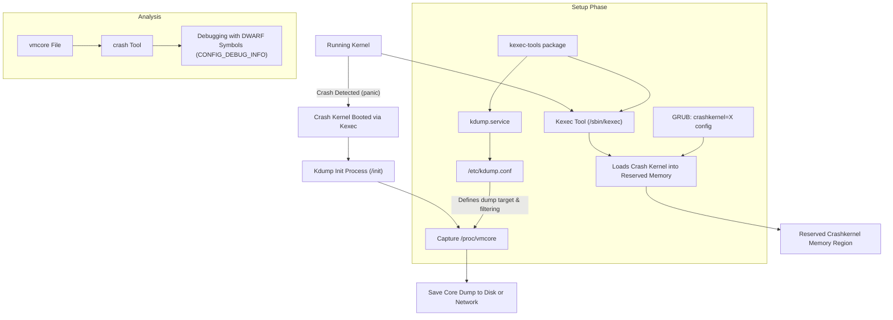

Kexec/KDump Crash Analysis
============

```mermaid
flowchart TD
    A[Running Kernel]
    A --> B["Kexec Tool (/sbin/kexec)"]
    B --> C[Loads Crash Kernel into Reserved Memory]
    C --> D[Reserved Crashkernel Memory Region]

    A -->|"Crash Detected (panic)"| E[Crash Kernel Booted via Kexec]

    E --> F["Kdump Init Process (/init)"]
    F --> G[Capture /proc/vmcore]
    G --> H[Save Core Dump to Disk or Network]

    subgraph Setup Phase
        I[kexec-tools package]
        J[kdump.service]
        K["/etc/kdump.conf"]
        L[GRUB: crashkernel=X config]

        I --> B
        I --> J
        J --> K
        K -->|Defines dump target & filtering| G
        L --> C
    end

    subgraph Analysis
        M[vmcore File]
        M --> N[crash Tool]
        N --> O["Debugging with DWARF Symbols (CONFIG_DEBUG_INFO)"]
    end
```
