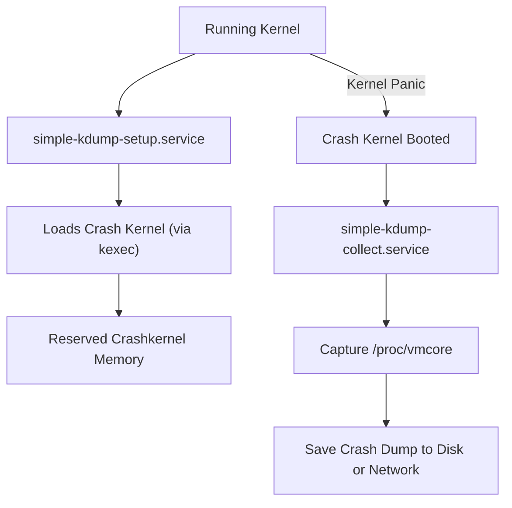

Kexec/KDump Crash Analysis
============

```mermaid
flowchart TD
    A[Running Kernel]
    A --> B["simple-kdump-setup.service"]
    B --> C["Loads Crash Kernel (via kexec)"]
    C --> D[Reserved Crashkernel Memory]

    A -->|"Kernel Panic"| E["Crash Kernel Booted"]

    E --> F["simple-kdump-collect.service"]
    F --> G["Capture /proc/vmcore"]
    G --> H["Save Crash Dump to Disk or Network"]

```
